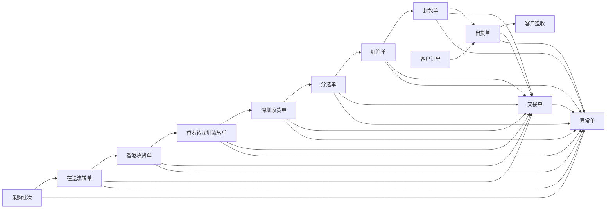
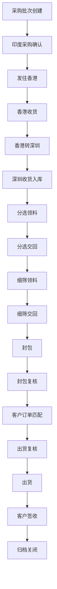

# 钻石 ERP 业务蓝图

## 1. 本轮梳理目标

本蓝图用于回答 5 个核心问题：

1. 订单或业务从哪里开始创建
2. 系统真正的主流程应该如何流转
3. 每一个环节分别由谁操作、谁确认、谁交接
4. 当前原型还缺哪些关键关口
5. 后续开发应围绕哪些单据和状态推进

本蓝图以当前项目现状为基础，按实操环境重新收束业务框架，避免继续在旧的演示型 `Order` 模型上扩写。

## 2. 核心结论

### 2.1 不再用单一“订单”贯穿全流程

当前系统里“订单”这个词容易混淆，后续应拆分为两类源头单据：

- `采购批次`：内部供应链主线的起点
- `客户订单`：销售与出货主线的起点

除这两类源头单据外，其余单据应尽量作为过程单据或系统自动生成单据，而不是每一步都让操作员重新手工建单。

### 2.2 系统应采用三层单据结构

#### 第一层：源头单据

- 采购批次
- 客户订单

#### 第二层：过程单据

- 在途流转单
- 收货单
- 分选单
- 细筛单
- 封包单
- 出货单

#### 第三层：控制与留痕单据

- 交接单
- 异常单
- 审计日志

### 2.3 当前系统现状

当前前端原型已具备以下骨架：

- 采购、在途、分选、细筛、封包、出货、扫码交接、异常处理的页面骨架已存在
- 扫码交接、异常单、交接详情、异常留痕已有可演示链路
- 账户、系统设置、企业微信预留结构已有基础

但当前仍存在 4 个关键缺口：

1. 缺正式的业务起点建单入口
2. 缺收货管理关口
3. 缺客户订单来源
4. 缺统一的单据自动生成和状态机规则

## 3. 订单与单据来源

## 3.1 采购批次

采购批次是整条内部供应链的起点，由采购员或采购主管创建。

建议创建时机：

- 与印度供应商确认采购后
- 明确来源地、石种、重量、粒数、预计到港时间后

建议创建人：

- 采购员
- 采购主管

建议作用：

- 作为在途、收货、分选、细筛、封包的共同源头
- 作为内部库存归属的源头依据

## 3.2 客户订单

客户订单是销售与出货链的起点，由销售、业务员或跟单创建。

建议创建时机：

- 客户下单
- 客户提出明确品质、重量、粒数或封包要求

建议创建人：

- 销售
- 客户经理
- 跟单

建议作用：

- 作为出货单的来源
- 作为封包匹配、出货复核、客户签收的来源

## 3.3 过程单据不应全部手工创建

以下单据建议优先通过“上一步完成后自动生成待办”方式产生：

- 在途流转单
- 收货单
- 分选单
- 细筛单
- 封包单
- 出货单
- 交接单

只有以下两类必须允许手工创建：

- 采购批次
- 客户订单

## 4. 单据关系图

## 5. 全流程工序图

## 6. 分环节实操说明

| 环节 | 起始动作 | 输出单据 | 责任角色 | 必须留痕 |
| --- | --- | --- | --- | --- |
| 采购创建 | 创建采购批次 | 采购批次 | 采购员 | 创建人、时间、来源附件 |
| 印度发运 | 确认发货并创建在途 | 在途流转单 | 采购员 | 发运人、承运、发运时间 |
| 香港收货 | 核对实收重量与粒数 | 香港收货单 | 香港收货员 | 收货人、复核人、差异结果 |
| 香港转深圳 | 发起转运交接 | 在途流转单、交接单 | 香港仓人员 | 交接双方、路线、重量粒数 |
| 深圳收货 | 到仓签收并入库 | 深圳收货单 | 深圳收货员 | 收货人、入库时间、差异说明 |
| 分选领料 | 从深圳仓领料 | 分选单、交接单 | 分选员 | 领料人、领料重量粒数 |
| 分选交回 | 分选完成交回 | 分选结果、交接单 | 分选员、细筛员 | 交回人、接收人、损耗 |
| 细筛作业 | 细筛与复检 | 细筛单 | 细筛员、复检人 | 规则、结果、复检结论 |
| 封包 | 封包与封签 | 封包单 | 封包员 | 封包人、封签码、数量 |
| 封包复核 | 封包检查 | 交接单、复核记录 | 复核人 | 复核人、复核结果 |
| 客户订单匹配 | 客户需求匹配封包 | 客户订单、出货单 | 销售、跟单 | 客户要求、匹配人 |
| 出货复核 | 出货前复核 | 出货单 | 出货员、复核人 | 出货人、物流信息 |
| 客户签收 | 客户扫码确认 | 交接单 | 客户、出货员 | 客户签收、企微确认 |

## 7. 角色责任表

| 角色 | 主要职责 | 可以创建的源头单据 | 关键确认动作 |
| --- | --- | --- | --- |
| 采购员 | 创建采购批次、发起印度发运 | 采购批次 | 发运确认、香港交接发起 |
| 香港收货员 | 香港收货与转运深圳 | 无 | 收货确认、香港转深圳交接 |
| 深圳收货员 | 深圳到仓签收与入库 | 无 | 深圳收货确认、仓内交接 |
| 分选员 | 分选领料、分选作业、分选交回 | 无 | 分选领料确认、分选交回确认 |
| 细筛员 | 细筛作业、细筛交回 | 无 | 细筛领料确认、细筛交回确认 |
| 封包员 | 封包、封签、待复核提交 | 无 | 封包完成确认 |
| 复核人 | 复核分选、细筛、封包、出货 | 无 | 复核放行或异常挂单 |
| 销售/跟单 | 创建客户订单、匹配客户需求 | 客户订单 | 出货申请确认 |
| 出货员 | 出货执行与客户签收跟进 | 无 | 出货扫码、客户签收跟进 |
| 系统管理员 | 账号、规则、编号、企业微信配置 | 无 | 权限、配置和流程规则维护 |

## 8. 状态机原则

## 8.1 总原则

- 主流程按前进方向推进，不允许自由回退
- 出现问题时，通过异常单冻结，而不是把原单据退回上一状态
- 关键交接节点必须完成扫码确认后，才能推进后续状态
- 业务取消时，走作废或关闭，不走倒退

## 8.2 推荐主状态机

1. 采购批次创建
2. 印度采购确认
3. 发往香港
4. 香港收货
5. 香港转深圳
6. 深圳收货入库
7. 待分选
8. 分选中
9. 待细筛
10. 细筛中
11. 待封包
12. 已封包
13. 待出货
14. 已出货
15. 客户已签收
16. 已归档
17. 异常冻结
18. 作废关闭

## 8.3 交接状态机

- 待发起
- 待扫码
- 已扫码
- 已确认
- 已完成
- 超时
- 异常

## 8.4 异常状态机

- 待处理
- 处理中
- 已解决
- 已关闭

## 9. 当前原型与目标蓝图的差异

## 9.1 当前已具备

- 左侧统一导航壳层
- 采购到出货的大部分页面骨架
- 扫码交接中心
- 异常单中心
- 交接详情、异常留痕、异常关闭前校验
- 企业微信字段预留与手工补录能力

## 9.2 当前缺失

### 业务起点缺失

- 没有正式的采购批次创建页
- 没有正式的客户订单创建页

### 中间关口缺失

- 没有香港收货页
- 没有深圳收货页
- 没有收货差异复核页

### 规则引擎缺失

- 没有统一的“完成上一单据后自动生成下一待办”规则
- 扫码任务仍主要由页面推导，不是统一任务中心

### 旧模型仍未退出

- 旧 `Order` 模型仍存在
- 旧 `订单管理` 仍是演示型收货页，不是真实主线入口

## 10. 本蓝图建议的最终页面结构

- 仪表盘
- 采购管理
- 在途流转
- 收货管理
- 分选管理
- 细筛管理
- 封包管理
- 客户订单
- 出货管理
- 扫码交接中心
- 异常处理
- 库存管理
- 账户管理
- 系统设置

## 11. 本轮建议先锁定的业务决定

为了避免后续返工，建议先确认以下 6 项：

1. 系统的主源头是否以 `采购批次 + 客户订单` 双起点为准
2. 旧 `订单管理` 是否改造成 `客户订单管理`，不再继续承担入库主线
3. 是否补建 `收货管理` 作为香港和深圳的正式关口
4. 是否采用“上一单完成后自动生成下一单待办”的单据模式
5. 是否规定关键关口不允许回退，只允许异常冻结
6. 是否把企业微信扫码确认作为交接推进的强规则，而不只是展示信息

## 12. 本蓝图的落地优先级

### 必须先做

- 业务起点定义
- 单据关系定义
- 收货关口定义
- 状态机定义

### 其次再做

- 页面创建入口
- 自动派单与待办中心
- 库存联动
- 报表联动

### 最后再做

- 企业微信真实接口
- 后端持久化
- 权限细化
- 审计与消息中心
