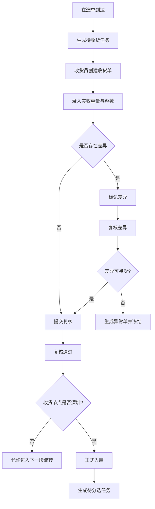

# 钻石 ERP 收货管理规格

## 1. 文档目的

本规格用于冻结供应链中最关键的中间关口：`收货管理`。

本规格覆盖以下 4 个主题：

1. 香港收货
2. 深圳收货
3. 收货差异复核
4. 入库与后续流程衔接规则

本规格要回答的核心问题：

1. 在途结束后由谁收货
2. 收货时必须核对哪些数据
3. 差异出现后先入库还是先挂异常
4. 什么时候才能进入分选待办

## 2. 收货管理定位

### 2.1 为什么收货管理必须单独建模块

收货管理是整条供应链从“在途”进入“在库”的分界点。

如果没有正式的收货关口，系统会出现以下问题：

- 在途状态结束后没有正式落账动作
- 香港到深圳、深圳入库之间缺少责任切换
- 后续分选领料缺少合法来源
- 差异无法沉淀为正式复核结果

因此，`收货管理` 应作为一级业务关口存在，而不是散落在 `在途流转` 或旧 `订单管理` 中。

### 2.2 收货管理承担的职责

收货管理负责：

- 接收来自在途流转的到货记录
- 生成正式收货单
- 记录应收与实收差异
- 触发复核或异常流程
- 决定是否允许正式入库
- 决定是否允许进入下一工序待办

## 3. 收货节点划分

系统应明确区分两个收货节点：

### 3.1 香港收货

适用场景：

- 印度采购批次抵达香港中转仓
- 香港人员对首段运输完成签收

职责重点：

- 核对印度发货与香港实收是否一致
- 判断是否可继续发往深圳
- 如有重大差异，先冻结并复核

### 3.2 深圳收货

适用场景：

- 香港转深圳流转完成
- 深圳仓库正式接收并准备入库

职责重点：

- 核对香港发出与深圳实收是否一致
- 完成正式入库
- 决定能否进入分选待办

## 4. 收货主流程

## 5. ReceiptRecord 单据定位

建议以 `ReceiptRecord` 作为正式收货单据。

它回答的是：

- 这次收的是哪一批货
- 来自哪一段在途
- 是在哪个站点收货
- 应收多少，实收多少
- 有没有差异
- 谁收货，谁复核，何时通过
- 是否允许继续推进下一环节

## 6. 收货单字段定义

| 字段 | 中文名称 | 类型 | 必填 | 录入方式 | 说明 |
| --- | --- | --- | --- | --- | --- |
| id | 内部ID | string | 是 | 系统生成 | 主键 |
| receiptNo | 收货单号 | string | 是 | 系统生成 | 建议格式 `RC+年月日+流水` |
| receiptType | 收货类型 | enum | 是 | 系统生成或人工选择 | `hk_receipt` 或 `sz_receipt` |
| batchId | 采购批次ID | string | 是 | 自动带出 | 来源于采购批次 |
| batchNo | 采购批次号 | string | 是 | 自动带出 | 业务展示用 |
| sourceTransitId | 来源在途ID | string | 是 | 自动带出 | 关联在途单 |
| sourceTransitNo | 来源在途单号 | string | 是 | 自动带出 | 业务展示用 |
| siteCode | 收货站点 | enum | 是 | 自动带出 | `HK` 或 `SZ` |
| siteName | 收货站点名称 | string | 是 | 自动带出 | 香港中转仓、深圳主仓等 |
| expectedWeight | 应收重量 | number | 是 | 自动带出 | 来自在途或上一节点 |
| actualWeight | 实收重量 | number | 是 | 人工填写 | 收货员称重录入 |
| weightDiff | 重量差异 | number | 是 | 系统计算 | `actual - expected` |
| expectedStoneCount | 应收粒数 | number | 是 | 自动带出 | 来自在途或上一节点 |
| actualStoneCount | 实收粒数 | number | 是 | 人工填写 | 收货员点数录入 |
| stoneDiff | 粒数差异 | number | 是 | 系统计算 | `actual - expected` |
| packageIntegrity | 外包装完好情况 | enum | 是 | 人工选择 | 完好、轻微破损、严重破损 |
| sealCheckResult | 封签核对结果 | enum | 否 | 人工选择 | 一致、不一致、无封签 |
| receiptPhotos | 收货照片 | string[] | 否 | 上传 | 到货照片、称重照片等 |
| receiverUserId | 收货人ID | string | 是 | 自动或人工选择 | 当前收货员 |
| receiverName | 收货人 | string | 是 | 自动带出 | 当前用户姓名 |
| reviewerUserId | 复核人ID | 否 | string | 人工选择 | 复核人 |
| reviewerName | 复核人 | 否 | string | 自动带出 | 复核账户名称 |
| receiptTime | 收货时间 | datetime | 是 | 系统生成或人工修正 | 实际收货时间 |
| reviewTime | 复核时间 | datetime | 否 | 系统生成 | 复核通过时写入 |
| differenceLevel | 差异等级 | enum | 是 | 系统判断 | none、minor、major |
| differenceReason | 差异说明 | string | 否 | 人工填写 | 发现差异时必填 |
| allowNextStep | 是否允许下一步 | boolean | 是 | 系统控制 | 控制能否推进 |
| inventoryPosted | 是否已入库 | boolean | 是 | 系统控制 | 深圳收货复核后才允许 true |
| exceptionCaseId | 关联异常单ID | string | 否 | 系统生成 | 差异超阈值时生成 |
| remark | 备注 | string | 否 | 人工填写 | 现场说明 |
| status | 当前状态 | enum | 是 | 系统控制 | 见状态定义 |
| createdBy | 创建人 | string | 是 | 系统生成 | 当前用户 |
| createdAt | 创建时间 | datetime | 是 | 系统生成 | 自动写入 |

## 7. 收货单状态定义

| 状态值 | 中文含义 | 说明 |
| --- | --- | --- |
| pending | 待收货 | 已生成待收货任务，未正式录入 |
| receiving | 收货中 | 已开始录入实收数据 |
| received | 已收货 | 收货员已提交，待复核 |
| reviewing | 复核中 | 复核人处理中 |
| reviewed | 已复核 | 已确认收货结果 |
| exception | 异常冻结 | 差异超阈值，已挂异常 |
| posted | 已入库 | 仅深圳收货允许进入此状态 |
| closed | 已关闭 | 该收货单流程结束 |
| voided | 已作废 | 无效单据关闭 |

## 8. 差异判断规则

### 8.1 差异类型

收货时至少判断以下差异：

- 重量差异
- 粒数差异
- 包装破损
- 封签不一致
- 附件缺失

### 8.2 差异等级建议

#### 无差异

满足以下条件：

- 重量一致
- 粒数一致
- 包装完好
- 封签一致或无需封签

系统处理：

- 允许直接进入复核

#### 轻微差异

示例：

- 重量或粒数有轻微偏差
- 包装轻微破损但货物正常
- 封签信息需要人工确认

系统处理：

- 允许提交复核
- 必须填写差异说明
- 由复核人决定是否放行

#### 重大差异

示例：

- 重量差异明显
- 粒数明显不符
- 包装严重破损
- 封签不一致且无法说明

系统处理：

- 自动生成异常单
- 收货单进入 `exception`
- 不允许进入下一环节

### 8.3 差异阈值建议

建议先采用配置化方式，而不是写死到代码：

- 重量差异阈值
- 粒数差异阈值
- 包装破损等级
- 封签不一致是否直接挂异常

这些阈值后续应纳入 `系统设置`。

## 9. 香港收货规则

### 9.1 前置条件

香港收货前必须满足：

1. 存在 `印度 -> 香港` 在途单
2. 在途状态至少为 `arrived`
3. 未存在未关闭的香港收货单

### 9.2 业务动作

香港收货员需完成：

1. 确认到货批次
2. 录入实收重量
3. 录入实收粒数
4. 核对包装与封签
5. 上传现场照片
6. 提交复核

### 9.3 香港收货后的流转规则

#### 复核通过且无重大差异

- 香港收货单进入 `reviewed`
- 允许发起 `香港 -> 深圳` 在途流转
- 可生成对应交接任务

#### 复核不通过或重大差异

- 自动挂异常
- 不允许发起深圳流转

## 10. 深圳收货规则

### 10.1 前置条件

深圳收货前必须满足：

1. 存在 `香港 -> 深圳` 在途单
2. 在途状态至少为 `arrived`
3. 未存在未关闭的深圳收货单

### 10.2 业务动作

深圳收货员需完成：

1. 确认到仓批次
2. 录入实收重量
3. 录入实收粒数
4. 核对包装与封签
5. 判断是否允许正式入库
6. 提交复核

### 10.3 深圳收货后的入库规则

#### 复核通过且无重大差异

- 深圳收货单进入 `reviewed`
- 正式入库标记为 true
- 收货单可进入 `posted`
- 采购批次状态推进为 `arrived_sz` 或 `in_processing`
- 系统自动生成待分选任务

#### 复核未通过或重大差异

- 自动挂异常
- 不允许入库
- 不生成待分选任务

## 11. 收货复核规则

### 11.1 复核人职责

复核人需判断：

- 差异是否真实存在
- 差异是否在可接受范围内
- 是否允许继续推进下一环节
- 是否必须先挂异常

### 11.2 复核动作建议

建议收货单详情页提供以下动作：

- `确认无误并通过`
- `带差异放行`
- `转异常处理`
- `退回补充资料`

### 11.3 退回补充资料说明

退回不是流程回退，而是当前收货单停留在复核阶段等待补充资料，不把业务单据倒退回在途状态。

## 12. 收货与异常联动规则

建议以下情况自动生成异常单：

1. 重量差异超过阈值
2. 粒数差异超过阈值
3. 包装严重破损
4. 封签核对失败
5. 收货超时未完成

异常生成后建议同步：

- 收货单状态改为 `exception`
- 采购批次或在途记录状态改为 `exception`
- 仪表盘与菜单出现异常提醒

## 13. 收货与交接联动规则

收货管理应与 `扫码交接` 联动，但二者职责不同：

- 交接单负责“谁交给谁、谁扫码确认”
- 收货单负责“到底收到了什么、是否与应收一致”

建议流程如下：

1. 在途到达
2. 交接扫码确认
3. 收货员创建收货单
4. 收货复核
5. 放行或异常

即：扫码确认不能替代正式收货核对。

## 14. 收货与库存联动规则

### 14.1 香港收货

香港收货后不建议直接进入深圳生产库存。

建议标记为：

- 香港中转在库
- 或香港待转运状态

### 14.2 深圳收货

深圳收货复核通过后，才允许进入：

- 深圳可分选库存

### 14.3 异常冻结

若收货挂异常：

- 不得进入可分选库存
- 应进入冻结库存或待复核状态

## 15. 页面结构建议

## 15.1 收货管理一级页面

建议一级页面命名为：

- `收货管理`

下设两个主视图：

- `香港收货`
- `深圳收货`

### 一级页建议展示

- 待收货数量
- 待复核数量
- 已挂异常数量
- 当日已入库数量
- 收货超时数量

## 15.2 收货列表页

建议支持以下筛选：

- 站点筛选
- 状态筛选
- 差异等级筛选
- 批次号搜索
- 在途单号搜索
- 时间范围筛选

## 15.3 收货详情页

建议分为以下区块：

1. 批次基础信息
2. 来源在途信息
3. 应收与实收对比
4. 包装与封签核对
5. 差异说明
6. 复核动作区
7. 关联交接单
8. 关联异常单

## 16. 与当前原型的改造建议

结合当前项目现状，建议按以下方式落地：

1. 在左侧主导航新增 `收货管理`
2. 新增 `ReceiptRecord` 对应类型与 store
3. 新增 `ReceiptManagement.tsx`
4. 在 `TransitManagement` 中增加“创建收货单”或“查看收货单”入口
5. 在 `PurchaseManagement` 中增加收货状态摘要
6. 在 `扫码交接` 中补“关联收货单”视角
7. 在 `异常处理` 中补收货差异类异常

## 17. 本规格冻结后可直接进入的开发动作

本规格确认后，可以直接进入以下开发：

1. 扩展类型定义：
   - `ReceiptRecord`
2. 扩展 store：
   - 创建收货单
   - 提交收货
   - 复核通过
   - 转异常处理
   - 入库放行
3. 新增页面：
   - `ReceiptManagement`
4. 衔接页面：
   - `TransitManagement`
   - `PurchaseManagement`
   - `ExceptionHandling`
   - `ScanConfirmation`

## 18. 待后续集中确认的业务点

建议后面集中确认以下事项：

1. 香港收货后是否需要单独的香港库存概念
2. 深圳收货后是否允许部分收货、部分入库
3. 收货差异阈值由谁配置
4. 收货复核是否必须双人完成
5. 收货照片是否作为必传附件

这些点不影响当前先冻结收货主框架，但会影响后续规则细化与权限设计。
